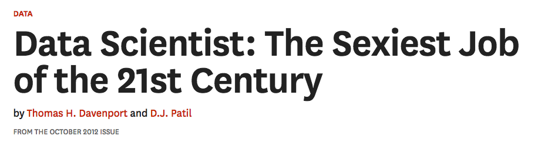

---
# YAML metadata
title: What is Data Science? Does It Matter?
author: Matthew Brett
bibliography: ../data-science-bib/data_science.bib
<#ifndef HANDOUT>
suppress-bibliography: true
<#endif>
---

# Handout

Go to <https://github.com/matthew-brett/bham-turing>

Look for `bham_turing_th1_handout.pdf` in the `townhall-1` directory.

# Thesis

* The UK is well behind the leaders in the US in its development of data science;
* To develop, we need to have a clear understanding of what data science means;
* If we are not to fall further behind, we need to invest our energy in
  reflection on the nature of data science, why it is important, and the
  changes it will bring to teaching and research.

# About me

* <https://www.turing.ac.uk/people/researchers/matthew-brett>
* Analysis of functional brain images, since 1996;
* At UC Berkeley from 2003-2005, 2008-2017.
* Read more at
  <https://matthew-brett.github.io/dsfe/chapters/01/what-is-data-science>

# A definition of data science ...

> The now-contemplated field of Data Science amounts to a superset of the
> fields of statistics and machine learning which adds some technology for
> ‘scaling up’ to ‘big data’. -- "50 years of data science" @donoho201550

# ... that would be a disastrous error

> The now-contemplated field of Data Science amounts to a superset of the
> fields of statistics and machine learning which adds some technology for
> ‘scaling up’ to ‘big data’. ...
>
> Choosing in this way is likely to miss out on the really important
> intellectual event of the next fifty years. -- @donoho201550

# Lesser and greater data science

* **Lesser data science**: superset of the fields of statistics and machine
  learning + technology for big data.
* **Greater data science**: a radical change in approach to data analysis,
  that emphasizes analysis with code, visualization, exploration and
  versatility.

# The future of data analysis (1962)

> Far better an approximate answer to the right question, which is often
> vague, than an exact answer to the wrong question, which can always be made
> precise.

"The future of data analysis" [@tukey1962future]

# Why it matters

We have to decide how to respond:

* Lesser data science: a small change:
    * Research: hire more machine learning experts
    * Teaching: expand advanced level courses in machine learning; add
      vocational courses for "data science" jobs.
* Greater data science: a large change:
    * Research: hire domain experts who have dealt with difficult data using
      computation.  Emphasize collaboration across disciplines.  Arrange university structures to support fluid collaboration.
    * Teaching: early undergraduate course in data analysis; transform teaching
      of data analysis across the curriculum.

# Is Donoho right?  Or can we live with Lesser?

* The origins of data science: Lesser or Greater?
* Developments in data science: Lesser or Greater?

# History of "data science"

{width=100%}

[@davenport2012data]

# The data scientist

> ... what data scientists do is make discoveries while swimming in data ...
> At ease in the digital realm, they are able to bring structure to large
> quantities of formless data and make analysis possible. ... Data scientists’
> most basic, universal skill is the ability to write code.

[@davenport2012data] - "Who Are These People?"

# Who are these people?

> Some of the best and brightest data scientists are PhDs in esoteric fields
> like ecology and systems biology. George Roumeliotis, the head of a data
> science team at Intuit in Silicon Valley, holds a doctorate in astrophysics.

[@davenport2012data] - "Who Are These People?"

# Data scientists are versatile

> ... on any given day, a team member could author a multistage processing
> pipeline in Python, design a hypothesis test, perform a regression analysis
> over data samples with R, design and implement an algorithm for some
> data-intensive product or service in Hadoop, or communicate the results of
> our analyses to other members of the organization.

Jeff Hammerbacher quoted in [@loukides2010what_is]

# Developments in data science: teaching

> ... academic institutions should encourage the development of a basic
> understanding of data science in all undergraduates.

@natacad2018ds

# Developments in data science: research

*   Careers
*   Education and Training
*   Tools and Software
*   Reproducibility and Open Science
*   Physical and Intellectual Space
*   Data Science Studies

Moore-Sloan Data Science Environments: Themes. <http://msdse.org/themes>. (\$37.8M).

# Data science at UC Berkeley

* [Supporting data science workshop: 2013](https://vcresearch.berkeley.edu/supporting-data-science-campus-wide-workshop-0)
* [Berkeley Institute of Data Science: 2013](https://bids.berkeley.edu/about)
* [Foundations of data science course: 2015](http://data8.org)
* [National workshop on data science education:
  2018](https://data.berkeley.edu/undergraduate-ds-pedagogy)
* [Division of data science: announced
  2018](https://news.berkeley.edu/2018/11/01/berkeley-inaugurates-division-of-data-science-and-information-connecting-teaching-and-research-from-all-corners-of-campus)

# Berkeley teaching programme

* Massive (~1500 student) course [Foundations of data
  science](https://data.berkeley.edu/education/courses/data-8).  No
  requirements in mathematics or programming.  Running since 2015.
* Large (~900 student) intermediate course [Principles and techniques of data
  science](http://www.ds100.org) with further requirements in Python programming and linear algebra.
* [27 Connector courses](https://data.berkeley.edu/education/connectors):
  domain applications of teaching methods from the foundation course.
* The greatest change in undergraduate teaching in a generation.

# Recruiting for data science research

* Berkeley [Division of data science](https://data.berkeley.edu).
* New recruitment half-time division of data science, half in their home
  department (of astronomy, psychology etc).

# Conclusion

* "Lesser data science" was an early reaction from the universities to a much
  larger cultural change in data analysis.
* This change, maybe described as "Greater data science" is going to transform
  teaching and research.
* Is we want to lead in the UK, and internationally, we need to choose our
  vision.

# The end

See: <https://github.com/matthew-brett/bham-turing> `townhall-1` for slides,
handouts, source.

<#ifdef HANDOUT>
# References
<#endif>
